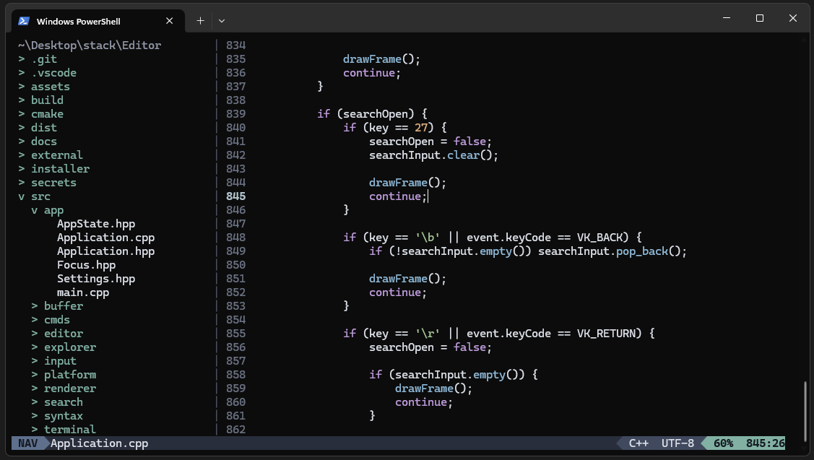
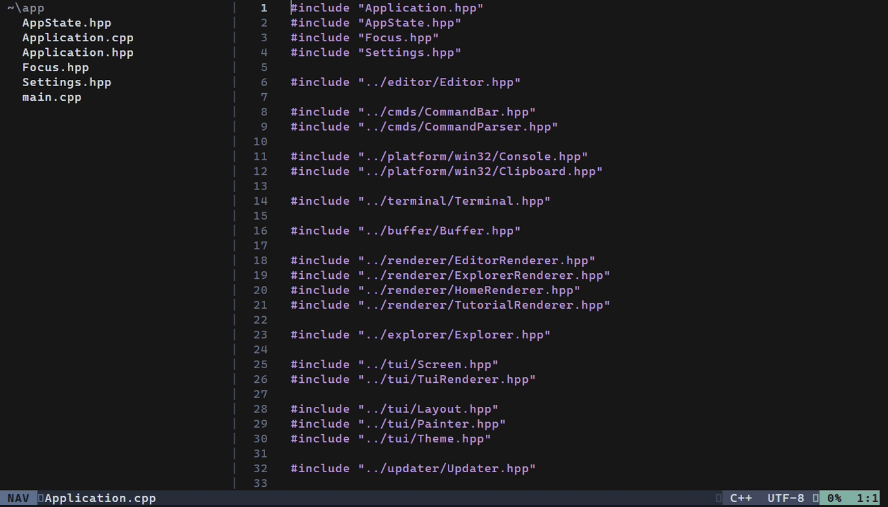

<p align="center">
  
</p>

<h1 align="center">Kiwi 🥝</h1>

<p align="center">
  A Windows-native modal terminal editor built around WASD navigation.
</p>

<p align="center">
  <a href="https://github.com/0x4D696E61/Kiwi/releases/latest">
    
  </a>
  
  
  <a href="LICENSE">
    
  </a>
</p>

<p align="center">
  <a href="https://github.com/0x4D696E61/Kiwi/releases/latest"><b>Download</b></a>
  ·
  <a href="#controls"><b>Controls</b></a>
  ·
  <a href="#commands"><b>Commands</b></a>
  ·
  <a href="#building-from-source"><b>Build</b></a>
</p>

<p align="center">
  
</p>

<p align="center">
  
</p>

<p align="center">
  <sub>Demo recorded in a virtual terminal. UI rendering may differ slightly from the native Windows Terminal experience.</sub>
</p>

## About

Kiwi is a terminal code editor built around keyboard navigation, modal editing, and a simple workspace.

It has its own terminal UI, file explorer, command system, recent files, configurable settings, and automatic updates.

Kiwi is currently in early development.

## Features

- NAV and EDIT editing modes
- Built-in file explorer
- Simple and Tree explorer modes
- File and directory workspaces
- Recent files
- Text and line selection
- Clipboard support
- Word navigation
- In-file search with match highlighting
- Automatic bracket and quote pairing
- Smart indentation
- Command bar
- Configurable UI settings
- Automatic updates
- Direct file and workspace opening from the command line

## Installation

Download the Windows installer from the [**latest release**](https://github.com/0x4D696E61/Kiwi/releases/latest).

After installation, Kiwi can check for new versions automatically. Available updates can be installed directly from the Home screen.

## Controls

Kiwi uses **NAV** for navigation and commands and **EDIT** for writing.

`Space` enters EDIT · `Left Ctrl` returns to NAV · `Left Ctrl + Space` switches Explorer/Editor focus

### NAV

| Keys | Action | Keys | Action |
| --- | --- | --- | --- |
| `W` / `S` | Up / Down | `A` / `D` | Left / Right |
| `qq` / `rr` | Previous / next word | `qQ` / `rR` | Previous / next WORD |
| `Shift + A` / `Shift + D` | Start / end of line | `gg` / `GG` | Start / end of file |
| `gt<number>` | Go to line | `%` | Matching bracket |
| `v` / `Shift + V` | Toggle selection / select line | `cc` / `cv` | Copy line / selection |
| `ca` | Paste | `xx` | Change word + EDIT |
| `xa` / `xv` | Change line / selection + EDIT | `/` | Search file |
| `n` / `N` | Next / previous match | `.` | Command bar |

Moving while a selection is active extends the selection. **WORD** navigation treats any sequence of non-whitespace characters as one WORD.

### EDIT

| Keys | Action | Keys | Action |
| --- | --- | --- | --- |
| Normal keys | Insert text | `Enter` | New line |
| `Backspace` | Delete / merge lines | `Tab` | Insert 4 spaces |
| `Left Ctrl` | Return to NAV | | |

### Explorer, Home & Settings

| Context | Keys | Action | Context | Keys | Action |
| --- | --- | --- | --- | --- | --- |
| Explorer | `W` / `S` | Move up / down | Explorer | `Enter` | Open / toggle directory |
| Explorer | `Backspace` | Parent directory | Explorer | `.` | Command bar |
| Explorer | `Left Ctrl + Space` | Switch focus | Home | `N` | New file |
| Home | `O` | Open file | Home | `S` | Settings |
| Home | `1`-`9` | Open recent file | Home | `.` | Command bar |
| Settings | `A` / `W` | Previous setting | Settings | `D` / `S` | Next setting |
| Settings | `Enter` | Toggle setting | Settings | `Esc` | Close Settings |

## Commands

Press `.` to open the command bar.

### Files

| Command | Action |
| --- | --- |
| `.new <path>` | Create a new file |
| `.open <path>` | Open a file |
| `.save` / `.s` | Save |
| `.saveas <path>` | Save to another path |
| `.goto <line>` | Go to a line |
| `.del <path>` / `.delete <path>` | Delete a file |

### Workspace

| Command | Action |
| --- | --- |
| `.home` | Return to Home |
| `.tree` | Toggle the file explorer |
| `.settings` | Open Settings |

### Exit

| Command | Action |
| --- | --- |
| `.q` / `.quit` | Quit |
| `.sq` / `.squit` / `.savequit` | Save and quit |
| `.fq` / `.fquit` / `.forcequit` | Force quit |

Normal quitting is blocked when the current file has unsaved changes.

## Opening files

Launch Kiwi normally:

```powershell
kiwi.exe
```

Open a file directly:

```powershell
kiwi.exe .\main.cpp
```

Or open a directory as a workspace:

```powershell
kiwi.exe .\MyProject
```

## Building from source

### Requirements

- Windows 11
- CMake 3.25+
- Ninja
- C++23-compatible compiler
- MSYS2 Clang64 recommended

### Build

```powershell
git clone https://github.com/0x4D696E61/Kiwi.git
cd Kiwi

cmake --preset debug
cmake --build --preset debug

.\build\debug\kiwi.exe
```

## Updates

Kiwi checks for updates when it starts.

Optional updates can be installed or dismissed from the Home screen. Mandatory updates install automatically.

Kiwi automatically restarts after a successful update.

## License

Kiwi is licensed under the [MIT License](LICENSE).

## Author

Created by **0x4D696E61**.